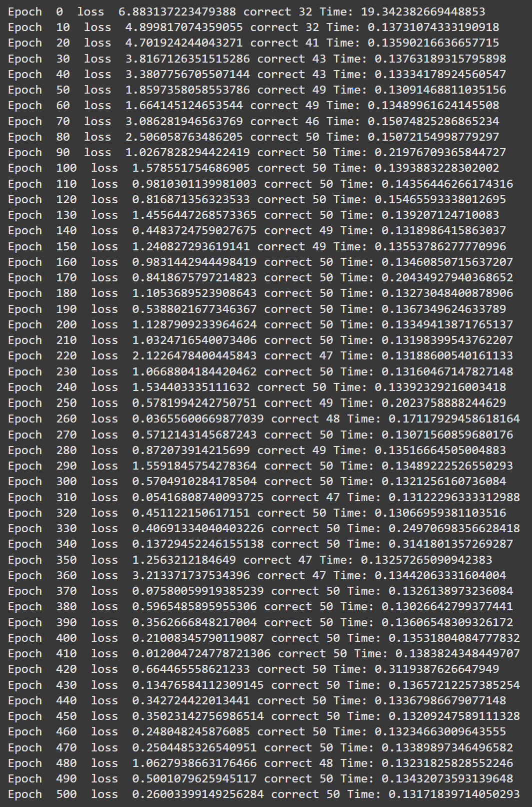
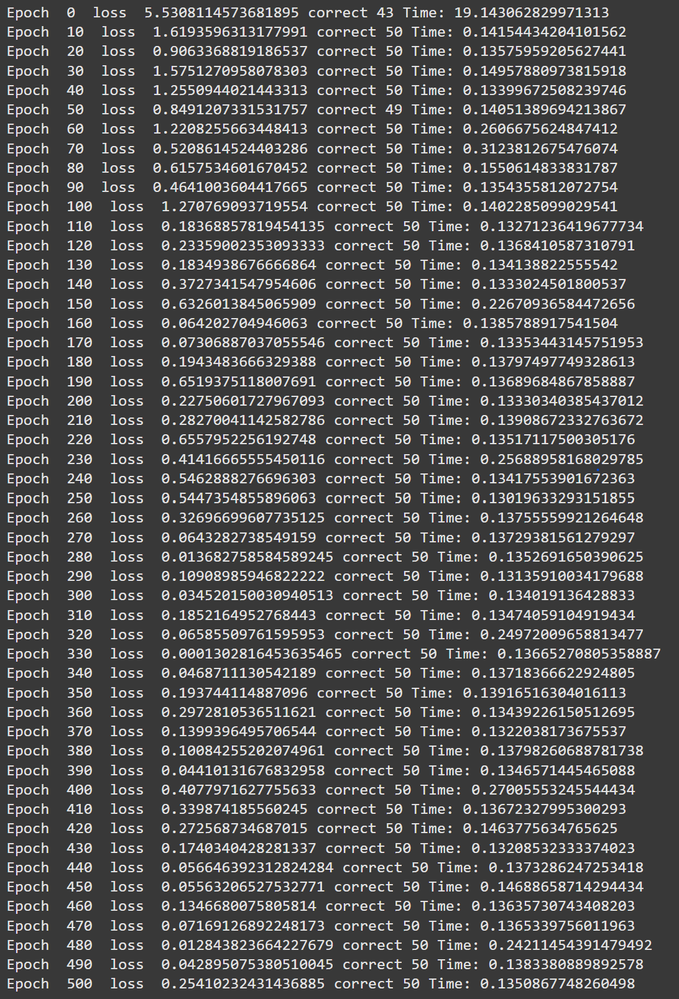
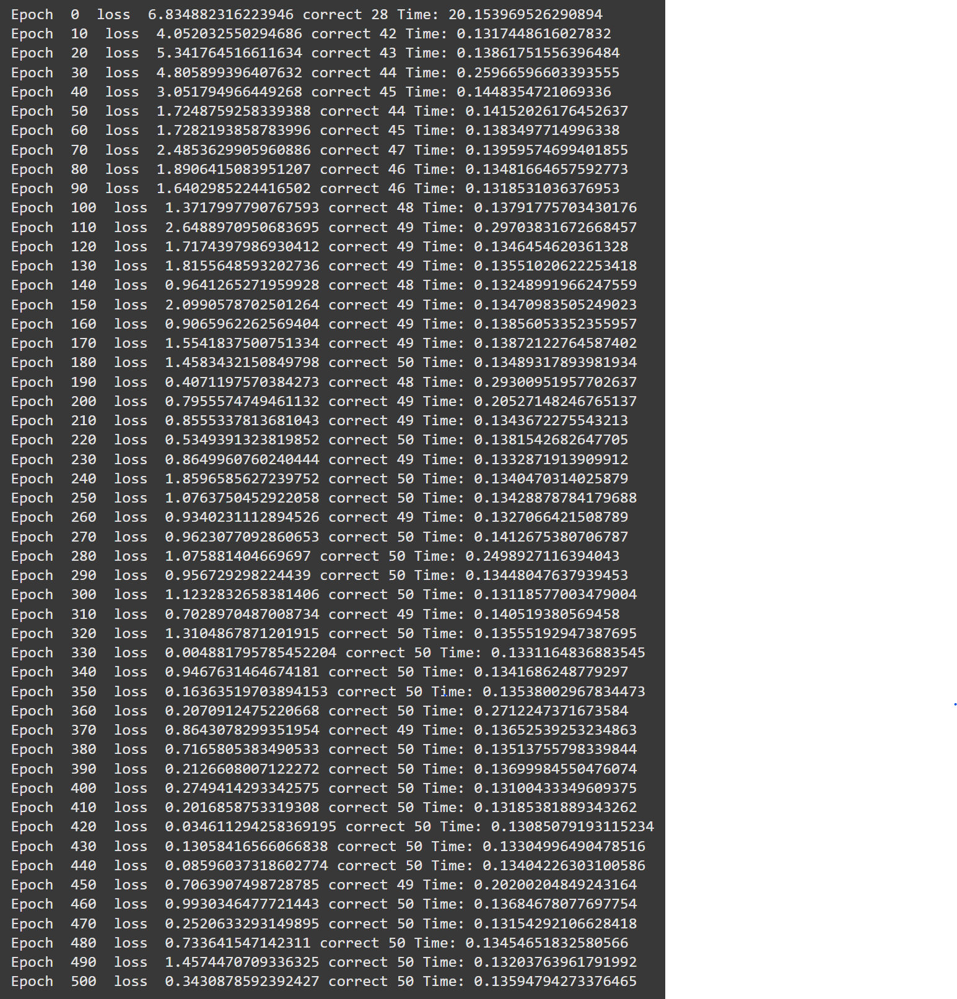
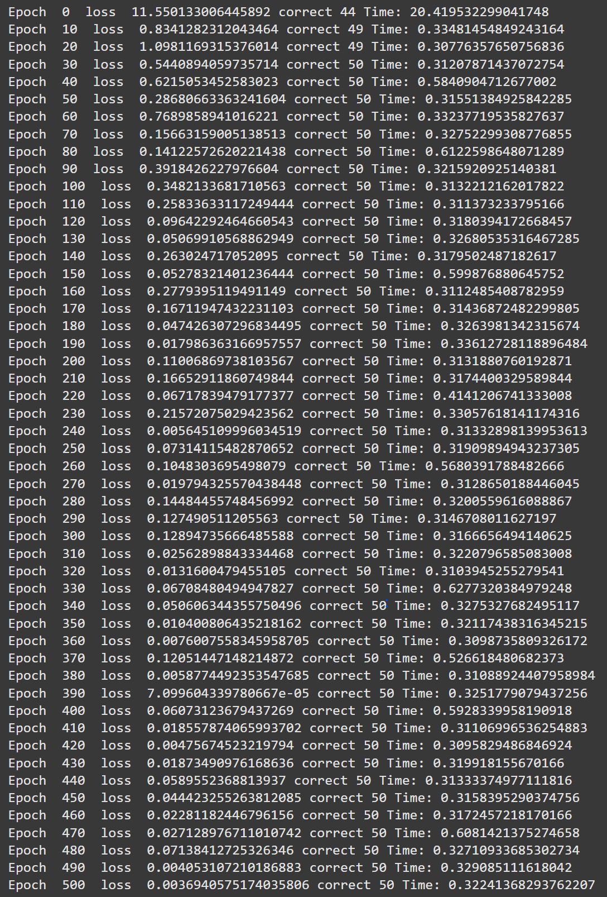

# MiniTorch Module 3


* Docs: https://minitorch.github.io/

* Overview: https://minitorch.github.io/module3.html


You will need to modify `tensor_functions.py` slightly in this assignment.

* Tests:

```
python run_tests.py
```

* Note:

Several of the tests for this assignment will only run if you are on a GPU machine and will not
run on github's test infrastructure. Please follow the instructions to setup up a colab machine
to run these tests.

This assignment requires the following files from the previous assignments. You can get these by running

```bash
python sync_previous_module.py previous-module-dir current-module-dir
```

The files that will be synced are:

        minitorch/tensor_data.py minitorch/tensor_functions.py minitorch/tensor_ops.py minitorch/operators.py minitorch/scalar.py minitorch/scalar_functions.py minitorch/module.py minitorch/autodiff.py minitorch/module.py project/run_manual.py project/run_scalar.py project/run_tensor.py minitorch/operators.py minitorch/module.py minitorch/autodiff.py minitorch/tensor.py minitorch/datasets.py minitorch/testing.py minitorch/optim.py

# Minitorch Module 3 Outputs
## Module 3.1: Parallel Checks
```
MAP

================================================================================
 Parallel Accelerator Optimizing:  Function tensor_map.<locals>._map,
/home/aaryapatel/CornellTech/mod3-aaryapatel100/minitorch/fast_ops.py (176)
================================================================================


Parallel loop listing for  Function tensor_map.<locals>._map, /home/aaryapatel/CornellTech/mod3-aaryapatel100/minitorch/fast_ops.py (176)
-----------------------------------------------------------------------------|loop #ID
    def _map(                                                                |
        out: Storage,                                                        |
        out_shape: Shape,                                                    |
        out_strides: Strides,                                                |
        in_storage: Storage,                                                 |
        in_shape: Shape,                                                     |
        in_strides: Strides,                                                 |
    ) -> None:                                                               |
        if np.array_equal(out_shape, in_shape) and np.array_equal(           |
            out_strides, in_strides                                          |
        ):                                                                   |
            for i in prange(len(out)):---------------------------------------| #2
                out[i] = fn(in_storage[i])                                   |
        else:                                                                |
            for i in prange(len(out)):---------------------------------------| #3
                out_index: Index = np.zeros(MAX_DIMS, np.int32)--------------| #0
                in_index: Index = np.zeros(MAX_DIMS, np.int32)---------------| #1
                to_index(i, out_shape, out_index)                            |
                broadcast_index(out_index, out_shape, in_shape, in_index)    |
                out[index_to_position(out_index, out_strides)] = fn(         |
                    in_storage[index_to_position(in_index, in_strides)]      |
                )                                                            |
--------------------------------- Fusing loops ---------------------------------
Attempting fusion of parallel loops (combines loops with similar properties)...

Fused loop summary:
+--0 has the following loops fused into it:
   +--1 (fused)
Following the attempted fusion of parallel for-loops there are 3 parallel for-
loop(s) (originating from loops labelled: #2, #3, #0).
--------------------------------------------------------------------------------
---------------------------- Optimising loop nests -----------------------------
Attempting loop nest rewrites (optimising for the largest parallel loops)...

+--3 is a parallel loop
   +--0 --> rewritten as a serial loop
--------------------------------------------------------------------------------
----------------------------- Before Optimisation ------------------------------
Parallel region 0:
+--3 (parallel)
   +--0 (parallel)
   +--1 (parallel)


--------------------------------------------------------------------------------
------------------------------ After Optimisation ------------------------------
Parallel region 0:
+--3 (parallel)
   +--0 (serial, fused with loop(s): 1)


Parallel region 0 (loop #3) had 1 loop(s) fused and 1 loop(s) serialized as part
 of the larger parallel loop (#3).
--------------------------------------------------------------------------------
--------------------------------------------------------------------------------

---------------------------Loop invariant code motion---------------------------
Allocation hoisting:
The memory allocation derived from the instruction at
/home/aaryapatel/CornellTech/mod3-aaryapatel100/minitorch/fast_ops.py (191) is
hoisted out of the parallel loop labelled #3 (it will be performed before the
loop is executed and reused inside the loop):
   Allocation:: out_index: Index = np.zeros(MAX_DIMS, np.int32)
    - numpy.empty() is used for the allocation.
The memory allocation derived from the instruction at
/home/aaryapatel/CornellTech/mod3-aaryapatel100/minitorch/fast_ops.py (192) is
hoisted out of the parallel loop labelled #3 (it will be performed before the
loop is executed and reused inside the loop):
   Allocation:: in_index: Index = np.zeros(MAX_DIMS, np.int32)
    - numpy.empty() is used for the allocation.
None
ZIP

================================================================================
 Parallel Accelerator Optimizing:  Function tensor_zip.<locals>._zip,
/home/aaryapatel/CornellTech/mod3-aaryapatel100/minitorch/fast_ops.py (225)
================================================================================


Parallel loop listing for  Function tensor_zip.<locals>._zip, /home/aaryapatel/CornellTech/mod3-aaryapatel100/minitorch/fast_ops.py (225)
------------------------------------------------------------------------------------------------------------|loop #ID
    def _zip(                                                                                               |
        out: Storage,                                                                                       |
        out_shape: Shape,                                                                                   |
        out_strides: Strides,                                                                               |
        a_storage: Storage,                                                                                 |
        a_shape: Shape,                                                                                     |
        a_strides: Strides,                                                                                 |
        b_storage: Storage,                                                                                 |
        b_shape: Shape,                                                                                     |
        b_strides: Strides,                                                                                 |
    ) -> None:                                                                                              |
        # stride_aligned = (out_shape == a_shape == b_shape) and (out_strides == a_strides == b_strides)    |
        if (                                                                                                |
            np.array_equal(out_shape, a_shape)                                                              |
            and np.array_equal(out_shape, b_shape)                                                          |
            and np.array_equal(out_strides, a_strides)                                                      |
            and np.array_equal(out_strides, b_strides)                                                      |
        ):                                                                                                  |
            for i in prange(len(out)):----------------------------------------------------------------------| #7
                out[i] = fn(a_storage[i], b_storage[i])                                                     |
        else:                                                                                               |
            for i in prange(len(out)):----------------------------------------------------------------------| #8
                out_index: Index = np.zeros(MAX_DIMS, np.int32)---------------------------------------------| #4
                a_index: Index = np.zeros(MAX_DIMS, np.int32)-----------------------------------------------| #5
                b_index: Index = np.zeros(MAX_DIMS, np.int32)-----------------------------------------------| #6
                # Convert the flat index `i` into a multidimensional index for the output                   |
                to_index(i, out_shape, out_index)                                                           |
                                                                                                            |
                # Broadcast the `out_index` to corresponding `a_index` and `b_index`                        |
                broadcast_index(out_index, out_shape, a_shape, a_index)                                     |
                broadcast_index(out_index, out_shape, b_shape, b_index)                                     |
                                                                                                            |
                # Compute the positions in `a_storage` and `b_storage`                                      |
                a_pos = index_to_position(a_index, a_strides)                                               |
                b_pos = index_to_position(b_index, b_strides)                                               |
                                                                                                            |
                # Apply the function `fn` to values from `a_storage` and `b_storage` and store in `out`     |
                out[index_to_position(out_index, out_strides)] = fn(                                        |
                    a_storage[a_pos], b_storage[b_pos]                                                      |
                )                                                                                           |
--------------------------------- Fusing loops ---------------------------------
Attempting fusion of parallel loops (combines loops with similar properties)...

Fused loop summary:
+--4 has the following loops fused into it:
   +--5 (fused)
   +--6 (fused)
Following the attempted fusion of parallel for-loops there are 3 parallel for-
loop(s) (originating from loops labelled: #7, #8, #4).
--------------------------------------------------------------------------------
---------------------------- Optimising loop nests -----------------------------
Attempting loop nest rewrites (optimising for the largest parallel loops)...

+--8 is a parallel loop
   +--4 --> rewritten as a serial loop
--------------------------------------------------------------------------------
----------------------------- Before Optimisation ------------------------------
Parallel region 0:
+--8 (parallel)
   +--4 (parallel)
   +--5 (parallel)
   +--6 (parallel)


--------------------------------------------------------------------------------
------------------------------ After Optimisation ------------------------------
Parallel region 0:
+--8 (parallel)
   +--4 (serial, fused with loop(s): 5, 6)


Parallel region 0 (loop #8) had 2 loop(s) fused and 1 loop(s) serialized as part
 of the larger parallel loop (#8).
--------------------------------------------------------------------------------
--------------------------------------------------------------------------------

---------------------------Loop invariant code motion---------------------------
Allocation hoisting:
The memory allocation derived from the instruction at
/home/aaryapatel/CornellTech/mod3-aaryapatel100/minitorch/fast_ops.py (247) is
hoisted out of the parallel loop labelled #8 (it will be performed before the
loop is executed and reused inside the loop):
   Allocation:: out_index: Index = np.zeros(MAX_DIMS, np.int32)
    - numpy.empty() is used for the allocation.
The memory allocation derived from the instruction at
/home/aaryapatel/CornellTech/mod3-aaryapatel100/minitorch/fast_ops.py (248) is
hoisted out of the parallel loop labelled #8 (it will be performed before the
loop is executed and reused inside the loop):
   Allocation:: a_index: Index = np.zeros(MAX_DIMS, np.int32)
    - numpy.empty() is used for the allocation.
The memory allocation derived from the instruction at
/home/aaryapatel/CornellTech/mod3-aaryapatel100/minitorch/fast_ops.py (249) is
hoisted out of the parallel loop labelled #8 (it will be performed before the
loop is executed and reused inside the loop):
   Allocation:: b_index: Index = np.zeros(MAX_DIMS, np.int32)
    - numpy.empty() is used for the allocation.
None
REDUCE

================================================================================
 Parallel Accelerator Optimizing:  Function tensor_reduce.<locals>._reduce,
/home/aaryapatel/CornellTech/mod3-aaryapatel100/minitorch/fast_ops.py (290)
================================================================================


Parallel loop listing for  Function tensor_reduce.<locals>._reduce, /home/aaryapatel/CornellTech/mod3-aaryapatel100/minitorch/fast_ops.py (290)
------------------------------------------------------------------------------------|loop #ID
    def _reduce(                                                                    |
        out: Storage,                                                               |
        out_shape: Shape,                                                           |
        out_strides: Strides,                                                       |
        a_storage: Storage,                                                         |
        a_shape: Shape,                                                             |
        a_strides: Strides,                                                         |
        reduce_dim: int,                                                            |
    ) -> None:                                                                      |
        # Iterate through the entire output storage                                 |
        for i in prange(len(out)):--------------------------------------------------| #10
            out_index: Index = np.zeros(MAX_DIMS, np.int32)-------------------------| #9
            reduce_size = a_shape[reduce_dim]                                       |
            # Get the corresponding multidimensional index for output               |
            to_index(i, out_shape, out_index)                                       |
            pos = index_to_position(out_index, out_strides)                         |
                                                                                    |
            # Iterate over the reduce dimension and apply the reduction function    |
            for j in range(reduce_size):                                            |
                out_index[reduce_dim] = j                                           |
                out[pos] = fn(                                                      |
                    out[pos], a_storage[index_to_position(out_index, a_strides)]    |
                )                                                                   |
--------------------------------- Fusing loops ---------------------------------
Attempting fusion of parallel loops (combines loops with similar properties)...
Following the attempted fusion of parallel for-loops there are 2 parallel for-
loop(s) (originating from loops labelled: #10, #9).
--------------------------------------------------------------------------------
---------------------------- Optimising loop nests -----------------------------
Attempting loop nest rewrites (optimising for the largest parallel loops)...

+--10 is a parallel loop
   +--9 --> rewritten as a serial loop
--------------------------------------------------------------------------------
----------------------------- Before Optimisation ------------------------------
Parallel region 0:
+--10 (parallel)
   +--9 (parallel)


--------------------------------------------------------------------------------
------------------------------ After Optimisation ------------------------------
Parallel region 0:
+--10 (parallel)
   +--9 (serial)


Parallel region 0 (loop #10) had 0 loop(s) fused and 1 loop(s) serialized as
part of the larger parallel loop (#10).
--------------------------------------------------------------------------------
--------------------------------------------------------------------------------

---------------------------Loop invariant code motion---------------------------
Allocation hoisting:
The memory allocation derived from the instruction at
/home/aaryapatel/CornellTech/mod3-aaryapatel100/minitorch/fast_ops.py (301) is
hoisted out of the parallel loop labelled #10 (it will be performed before the
loop is executed and reused inside the loop):
   Allocation:: out_index: Index = np.zeros(MAX_DIMS, np.int32)
    - numpy.empty() is used for the allocation.
None
```
## Module 3.2: Parallel Checks
```
MATRIX MULTIPLY

================================================================================
 Parallel Accelerator Optimizing:  Function _tensor_matrix_multiply,
/home/aaryapatel/CornellTech/mod3-aaryapatel100/minitorch/fast_ops.py (317)
================================================================================


Parallel loop listing for  Function _tensor_matrix_multiply, /home/aaryapatel/CornellTech/mod3-aaryapatel100/minitorch/fast_ops.py (317)
--------------------------------------------------------------------------------------------|loop #ID
def _tensor_matrix_multiply(                                                                |
    out: Storage,                                                                           |
    out_shape: Shape,                                                                       |
    out_strides: Strides,                                                                   |
    a_storage: Storage,                                                                     |
    a_shape: Shape,                                                                         |
    a_strides: Strides,                                                                     |
    b_storage: Storage,                                                                     |
    b_shape: Shape,                                                                         |
    b_strides: Strides,                                                                     |
) -> None:                                                                                  |
    """NUMBA tensor matrix multiply function.                                               |
                                                                                            |
    Should work for any tensor shapes that broadcast as long as                             |
                                                                                            |
    ```                                                                                     |
    assert a_shape[-1] == b_shape[-2]                                                       |
    ```                                                                                     |
                                                                                            |
    Optimizations:                                                                          |
                                                                                            |
    * Outer loop in parallel                                                                |
    * No index buffers or function calls                                                    |
    * Inner loop should have no global writes, 1 multiply.                                  |
                                                                                            |
                                                                                            |
    Args:                                                                                   |
    ----                                                                                    |
        out (Storage): storage for `out` tensor                                             |
        out_shape (Shape): shape for `out` tensor                                           |
        out_strides (Strides): strides for `out` tensor                                     |
        a_storage (Storage): storage for `a` tensor                                         |
        a_shape (Shape): shape for `a` tensor                                               |
        a_strides (Strides): strides for `a` tensor                                         |
        b_storage (Storage): storage for `b` tensor                                         |
        b_shape (Shape): shape for `b` tensor                                               |
        b_strides (Strides): strides for `b` tensor                                         |
                                                                                            |
    Returns:                                                                                |
    -------                                                                                 |
        None : Fills in `out`                                                               |
                                                                                            |
    """                                                                                     |
    a_batch_stride = a_strides[0] if a_shape[0] > 1 else 0                                  |
    b_batch_stride = b_strides[0] if b_shape[0] > 1 else 0                                  |
                                                                                            |
    assert a_shape[-1] == b_shape[-2]                                                       |
                                                                                            |
    for depth in prange(out_shape[0]):------------------------------------------------------| #11
        for i in range(out_shape[1]):                                                       |
            for j in range(out_shape[2]):                                                   |
                pos = depth * out_strides[0] + i * out_strides[1] + j * out_strides[2]      |
                summ = 0.0                                                                  |
                for k in range(a_shape[-1]):                                                |
                    a_pos = depth * a_batch_stride + i * a_strides[1] + k * a_strides[2]    |
                    b_pos = depth * b_batch_stride + k * b_strides[1] + j * b_strides[2]    |
                    summ += a_storage[a_pos] * b_storage[b_pos]                             |
                out[pos] = summ                                                             |
--------------------------------- Fusing loops ---------------------------------
Attempting fusion of parallel loops (combines loops with similar properties)...
Following the attempted fusion of parallel for-loops there are 1 parallel for-
loop(s) (originating from loops labelled: #11).
--------------------------------------------------------------------------------
----------------------------- Before Optimisation ------------------------------
--------------------------------------------------------------------------------
------------------------------ After Optimisation ------------------------------
Parallel structure is already optimal.
--------------------------------------------------------------------------------
--------------------------------------------------------------------------------

---------------------------Loop invariant code motion---------------------------
Allocation hoisting:
No allocation hoisting found
None
```
## Module 3.4
### Time Graph


## Module 3.5
### Split Dataset (GPU & CPU)
`!cd $DIR; PYTHONPATH=/content/$DIR python3.12 project/run_fast_tensor.py --BACKEND gpu --HIDDEN 100 --DATASET split --RATE 0.05`


`!cd $DIR; PYTHONPATH=/content/$DIR python3.12 project/run_fast_tensor.py --BACKEND cpu --HIDDEN 100 --DATASET split --RATE 0.05`


### Simple Dataset (GPU & CPU)
`!cd $DIR; PYTHONPATH=/content/$DIR python3.12 project/run_fast_tensor.py --BACKEND gpu --HIDDEN 100 --DATASET simple --RATE 0.05`


`!cd $DIR; PYTHONPATH=/content/$DIR python3.12 project/run_fast_tensor.py --BACKEND cpu --HIDDEN 100 --DATASET simple --RATE 0.05`


### XOR Dataset (GPU & CPU)
`!cd $DIR; PYTHONPATH=/content/$DIR python3.12 project/run_fast_tensor.py --BACKEND gpu --HIDDEN 100 --DATASET xor --RATE 0.05`


`!cd $DIR; PYTHONPATH=/content/$DIR python3.12 project/run_fast_tensor.py --BACKEND cpu --HIDDEN 100 --DATASET xor --RATE 0.05`


### Simple (Hidden=200) Dataset (GPU & CPU)
`!cd $DIR; PYTHONPATH=/content/$DIR python3.12 project/run_fast_tensor.py --BACKEND gpu --HIDDEN 200 --DATASET simple --RATE 0.05`


`!cd $DIR; PYTHONPATH=/content/$DIR python3.12 project/run_fast_tensor.py --BACKEND cpu --HIDDEN 200 --DATASET simple --RATE 0.05`

